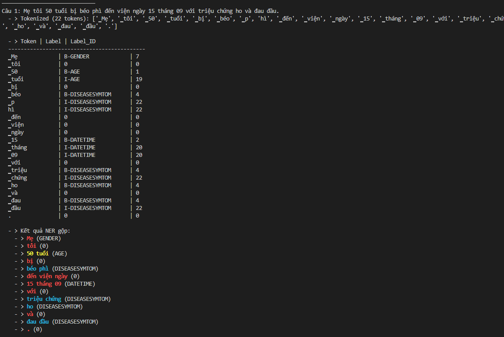
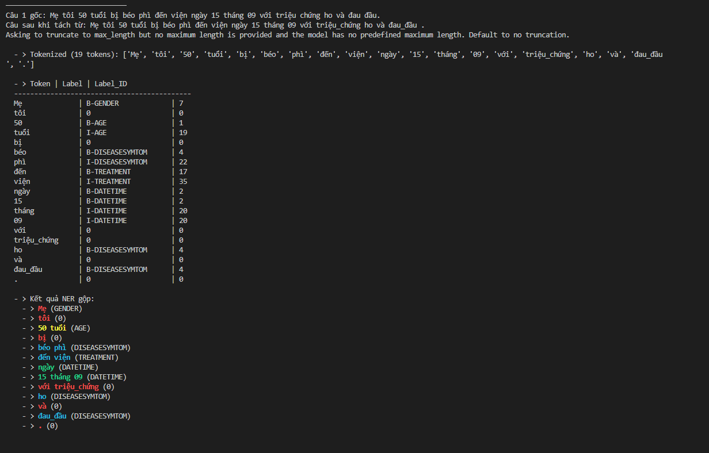

# Medical Named Entity Recognition (NER)

## Overview

This project focuses on **Medical Named Entity Recognition (NER)** — a crucial Natural Language Processing (NLP) task in healthcare that involves identifying and classifying medical terms (entities) from unstructured clinical texts such as medical records, prescriptions, and reports.

We developed and evaluated two transformer-based models:
- **XLM-RoBERTa-Base**
- **ViHealthBERT-Base-Word**

Both models were fine-tuned on a Vietnamese medical dataset containing **37 entity labels**, representing diverse aspects of healthcare such as diseases, drugs, symptoms, treatments, and anatomical terms.

The goal of this project is to enhance the ability of machine learning models to extract domain-specific entities accurately, which can later support downstream applications like medical report summarization, patient record structuring, and clinical decision support systems.

---

## Entity Labels

The dataset contains **37 entity types**, covering a wide range of biomedical and healthcare-related categories:

| ID | Label | Description |
|----|--------|--------------|
| 0  | O | Outside any named entity |
| 1  | B-AGE | Beginning of Age entity |
| 2  | B-DATETIME | Beginning of Date/Time expression |
| 3  | B-DIAGNOSTICS | Beginning of Diagnostic term |
| 4  | B-DISEASESYMTOM | Beginning of Disease or Symptom |
| 5  | B-DRUGCHEMICAL | Beginning of Drug or Chemical compound |
| 6  | B-FOODDRINK | Beginning of Food or Drink item |
| 7  | B-GENDER | Beginning of Gender term |
| 8  | B-LOCATION | Beginning of Location or Place |
| 9  | B-MEDDEVICETECHNIQUE | Beginning of Medical Device or Technique |
| 10 | B-OCCUPATION | Beginning of Occupation entity |
| 11 | B-ORGAN | Beginning of Organ name |
| 12 | B-ORGANIZATION | Beginning of Organization name |
| 13 | B-PERSONALCARE | Beginning of Personal Care term |
| 14 | B-PREVENTIVEMED | Beginning of Preventive Medicine term |
| 15 | B-SURGERY | Beginning of Surgery term |
| 16 | B-TRANSPORTATION | Beginning of Transportation term |
| 17 | B-TREATMENT | Beginning of Treatment method |
| 18 | B-UNITCALIBRATOR | Beginning of Unit or Calibrator term |
| 19 | I-AGE | Inside Age entity |
| 20 | I-DATETIME | Inside Date/Time expression |
| 21 | I-DIAGNOSTICS | Inside Diagnostic term |
| 22 | I-DISEASESYMTOM | Inside Disease or Symptom |
| 23 | I-DRUGCHEMICAL | Inside Drug or Chemical compound |
| 24 | I-FOODDRINK | Inside Food or Drink item |
| 25 | I-GENDER | Inside Gender term |
| 26 | I-LOCATION | Inside Location or Place |
| 27 | I-MEDDEVICETECHNIQUE | Inside Medical Device or Technique |
| 28 | I-OCCUPATION | Inside Occupation entity |
| 29 | I-ORGAN | Inside Organ name |
| 30 | I-ORGANIZATION | Inside Organization name |
| 31 | I-PERSONALCARE | Inside Personal Care term |
| 32 | I-PREVENTIVEMED | Inside Preventive Medicine term |
| 33 | I-SURGERY | Inside Surgery term |
| 34 | I-TRANSPORTATION | Inside Transportation term |
| 35 | I-TREATMENT | Inside Treatment method |
| 36 | I-UNITCALIBRATOR | Inside Unit or Calibrator term |

---

## Models Used

To evaluate performance across linguistic and domain scopes, two transformer-based models were fine-tuned and compared:

| Model | Description | Focus |
|--------|--------------|--------|
| **XLM-RoBERTa-base** | A multilingual transformer pretrained on 100+ languages, including Vietnamese. | Provides strong general NER performance, but limited in-domain medical vocabulary. |
| **ViHealthBERT-base-word** | A Vietnamese biomedical transformer pretrained on large-scale clinical and health-related texts. | Offers superior understanding of Vietnamese medical terminology and entity boundaries. |

The experiments show that **ViHealthBERT** achieves higher precision, recall, and F1-score than **XLM-RoBERTa**, particularly on **rare or domain-specific entities** such as drug names, disease types, and measurement units.

---
## Instruction
#### Installation 
1. **Clone the repository**
   ```bash
   git clone https://github.com/tominhduc01082003/Name_Entity_Recognition_In_Medicine
   cd Name_Entity_Recognition_In_Medicine
2. **Setup environement** 
   ```bash
     python --version
     python -m venv .venv
    .venv/Scripts/activate
3. **Install Dependencies**
   ```bash
   pip install -r requirements.txt #Python >=3.13.7
   ```
   
4. **Verify GPU Support**
   Check GPU availability
   ```bash
   python Check_Gpu.py
5. **Install and check Vncore**
   ```bash
   python Install_Vncore.py
   python Test_Vncore.py
---
####  Dataset Preparation
1. **Install datasets from leduckhai/VietMed-NER:** 
    ```bash
    cd ./Install_Datasets
    python Install_Datasets.py
2. **Prepare data:** 
- Default when you run python Install_Datasets.py in :**C:\Users\Admin\.cache\huggingface\datasets\arrow**.Cut data in folder and put data in repo "./Datasets" 

#### Training
1. **Roberta_base**
   ```python
   cd ./Models/Robert_Base/Training/
   python Train.py
2. **Vihealthbert_Ner**
   ```python
   cd ./Models/Vihealthbert_Ner/Training/
   python Train.py   
---
#### Inference
##### Testing
1. **Roberta_base**
- **Eval Pre,re,f1 in Test and some outside samples**  
   ```python
   cd ./Models/Robert_Base/Testing/
   python Test.py
   python Sample.py
---
1. **Vihealthbert_Ner**
- **Eval Pre,re,f1 in Test and some outside samples**  
   ```python
   cd ./Models/Vihealthbert_Ner/Testing/
   python Test.py
   python Sample.py
## Result
**Roberta_base**:

**Vihealthbert_Ner**:

| Model | Macro Precision | Macro Recall | Macro F1 | Micro Precision | Micro Recall | Micro F1 | Weighted Precision | Weighted Recall | Weighted F1 |
|:------|:----------------:|:-------------:|:---------:|:----------------:|:-------------:|:---------:|:-------------------:|:----------------:|:-------------:|
| **XLM-RoBERTa-Base** | **0.6630** | **0.7583** | **0.6817** | **0.8910** | **0.8910** | **0.8910** | **0.9095** | **0.8910** | **0.8978** |
| ViHealthBERT-Base-Word | 0.5748 | 0.6934 | 0.5979 | 0.8841 | 0.8841 | 0.8841 | 0.9087 | 0.8841 | 0.8934 |


---
## Contact
- To Minh Duc (ducto020803@gmail.com)